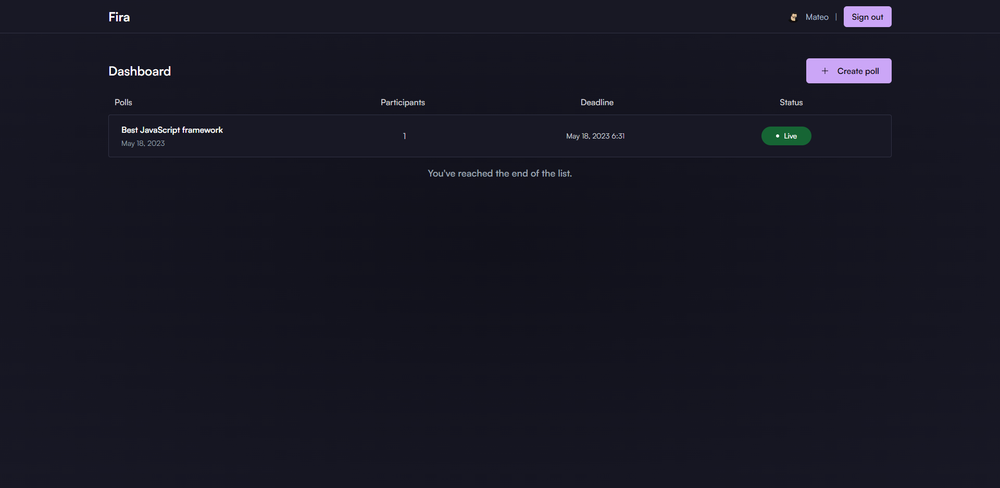
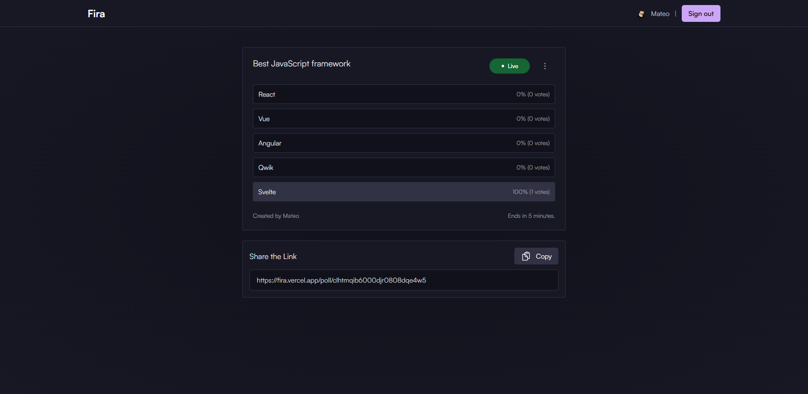
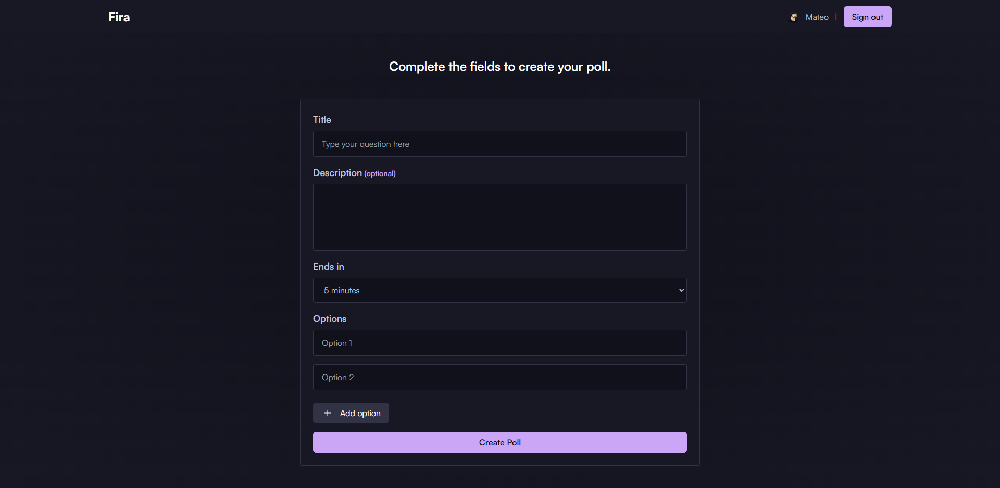

## [📷] Demo


### /dash



### /poll/:id



### /create



###

## [📦] Built with:

- **[Next.js](https://nextjs.org/)** with [TypeScript](https://www.typescriptlang.org/) - The React Framework for Production.
- **[Next-Auth](https://next-auth.js.org/)** - Authentication for Next.js.
- **[Prisma](https://www.prisma.io/)** with **[PostgreSQL](https://www.postgresql.org/)** - Next-generation Node.js and TypeScript ORM.
- **[Tailwind CSS](https://tailwindcss.com/)** with [clsx](https://github.com/lukeed/clsx) - A utility-first CSS framework for rapidly building custom designs.
- **[React-Hook-Forms](https://react-hook-form.com/)** - Performant, flexible and extensible forms with easy-to-use validation.
- **[Zod](https://zod.dev/)** - TypeScript-first schema validation.

## [🎉] Features

- [x] Authentication with GitHub.
- [x] Users can create new poll.
- [x] Users can vote on poll options.
- [x] Users can view their polls.
- [x] Users can delete their polls.

## [🔧] How to run it locally

> 🚧 You will need [Git](https://git-scm.com/downloads) and [Node.js (version 16 or higher)](https://nodejs.org/en) installed.

### **Installation:**

1. Clone the repository:

```bash
git clone git@github.com:techwithmat/fira.git
```

2. Install dependencies:

```bash
pnpm install
#or
npm install
#or
yarn install
```

### **Configuration:**

1. Create a `.env` file in the root of the project with the following variables:

```bash
# Postgres Database URL:
DATABASE_URL:

# Github OAuth secrets:
GITHUB_ID:
GITHUB_CLIENT_SECRET:

# Next Auth config:
SECRET:
NEXTAUTH_URL:
```

#### **Github OAuth Provider:**

1. Register your application on [Github Developer Settings](https://github.com/settings/developers) and obtain a client ID and a client secret.

2. Update the .env file with the following variables:

```bash
# Github OAuth Provider:
GITHUB_CLIENT_ID=
GITHUB_CLIENT_SECRET=
```

### **Running the Application:**

10. Run in your terminal:

```bash
npm run dev
# or
pnpm run dev
# or
yarn dev
```

Open [http://localhost:3000](http://localhost:3000) in your web browser to access the application.

## [📂] Folder structure

```bash
.
├── public
├── prisma
│── src
│   ├── app
│   │   ├── api
│   │   └── ...
│   ├── components
│   │   ├── poll
│   │   └── ui
│   │       ├── icons
│   │       └── ...
│   ├── config
│   ├── lib
│   ├── providers
│   ├── services
│   │── types
│   ├── styles
│   │   └── globals.css
│   │─── tests
│   │   └── setup.ts
/   └──middleware.ts
```

- `/prisma`: Database schema definitions or configurations using Prisma ORM.
- `/public`: Publicly accessible files for the web application.
- `/src/services`: Services used by the application.
- `/src/app`: Application logic and entry point.
- `/src/config`: Configuration files for the application.
- `/src/tests`: Setup files and test files for the application..
- `/src/types`: Type definitions for the application.
- `/src/providers`: Providers for the application.
- `/src/components/ui`: User interface components for the application.
- `/src/lib/validations`: Validation utilities for the application.

## [🔑] License

- [MIT](https://github.com/techwithmat/fira/blob/main/LICENSE)
